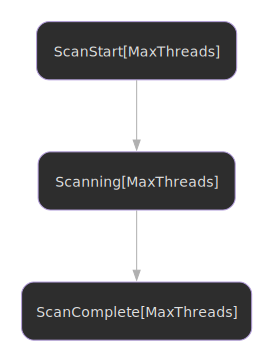

# Neutralization

Understanding the thread-neutralization protocol. The protocol is
platform-specific (POSIX uses signal delivery; Windows uses
SuspendThread/ResumeThread), but the API is identical on both
platforms.

## State Machine



## Overview

Neutralization solves the stalled thread problem: what happens when a thread stays pinned for a long time? Without intervention, it blocks reclamation and memory accumulates unboundedly.

DEBRA+ uses POSIX signals (or, on Windows, SuspendThread/ResumeThread) to neutralize stalled threads, allowing epoch advancement and bounded memory.

## The Stalled Thread Problem

If a thread stays pinned at an old epoch:

- Reclamation is blocked indefinitely
- Memory accumulates in limbo bags
- System may run out of memory

## How Neutralization Works

### POSIX (Linux, macOS, BSD)

1. **Detection**: Reclamation detects thread pinned at old epoch
2. **Signal**: Send SIGUSR1 to stalled thread (`pthread_kill`)
3. **Handler**: Signal handler runs asynchronously in the target's
   context and flips `pinned=false`, `neutralized=true` for the
   target's slot
4. **Check**: Thread observes the flag on next pin attempt
5. **Acknowledge**: Thread acknowledges neutralization
6. **Advance**: Safe epoch can now advance past stalled thread

### Windows

1. **Detection**: Reclamation detects thread pinned at old epoch
2. **Suspend**: Scanner calls `SuspendThread` on the target's
   duplicated handle
3. **Flip**: Scanner directly walks the manager's `threads[]` array
   and flips `pinned=false`, `neutralized=true` for the target's slot
4. **Resume**: Scanner calls `ResumeThread`
5. **Check**: Thread observes the flag on next pin attempt
6. **Advance**: Safe epoch can now advance past stalled thread

The Windows arm is semantically equivalent to the POSIX arm — both
result in the target slot being flipped. The difference is that the
flip happens synchronously on the scanner side (Windows) rather than
asynchronously in the target's context (POSIX). The same byte-stride
descriptor is used for the slot walk on both platforms.

## Triggering Neutralization

The simple convenience API allows scanning for and signaling stalled threads:

```nim
let signalsSent = neutralizeStalled(manager)
```

This returns the number of signals sent to stalled threads.

The `epochsBeforeNeutralize` parameter controls how far behind a thread must be before neutralization (default is 2 epochs):

```nim
let signalsSent = neutralizeStalled(manager, epochsBeforeNeutralize = 3)
```

For advanced use cases, the low-level typestate API provides explicit control over each step:

```nim
let complete = scanStart(addr manager)
  .loadEpoch(epochsBeforeNeutralize = 2)
  .scanAndSignal()
let count = complete.extractSignalCount()
```

## Neutralization Handling Example

```nim

```

[:material-file-code: View full source](https://github.com/elijahr/nim-debra/blob/main/examples/neutralization_handling.nim)

## Neutralization Semantics

Neutralization is **advisory**, not forceful:

- Thread is **not** stopped mid-computation
- Thread is **not** killed or interrupted
- Thread **continues** running normally
- Flag is **checked** on next unpin

### Safety Guarantees

- Neutralization cannot corrupt memory
- Thread completes current operation safely
- Lock-free operations remain atomic
- Memory ordering is preserved

### Limitations

Neutralization cannot:

- Stop a thread in an infinite loop
- Interrupt blocking system calls
- Force a thread to check the flag
- Guarantee timely response

## Configuration

### Neutralization Threshold

How far behind before neutralizing? Default is 2 epochs.

Lower threshold = more aggressive neutralization, better memory bounds, more interruptions.

Higher threshold = more lenient on long operations, higher memory usage, fewer interruptions.

### Signal Choice (POSIX only)

DEBRA+ uses SIGUSR1 by default on POSIX. Requirements:

- Must not be used by application
- Must not have default handler
- Must be available on platform

On Windows there is no signal involved; neutralization uses
`SuspendThread` / `ResumeThread` and no signal number is consumed.

## Platform Considerations

Neutralization is supported on:

- **POSIX** (Linux, macOS, BSD): via `pthread_kill` + SIGUSR1 async
  handler.
- **Windows**: via `SuspendThread` / `ResumeThread` invoked
  synchronously by the scanner. Added in v0.10.0.

The API surface is identical on both platforms; the implementation
detail is hidden behind `debra/signal.neutralizeRemoteSlot`.

### Deadlock Constraint (Both Platforms)

Do NOT invoke DEBRA reclamation while holding a lock that other
DEBRA-using threads might be blocked on. The constraint exists on
both platforms but the mechanism differs:

- **POSIX**: the SIGUSR1 handler runs in the target's context and
  may need to acquire shared state.
- **Windows**: the scanner blocks briefly inside `SuspendThread`
  (kernel call), then walks the manager directly. The risk is the
  target holding a lock that the scanner needs *after* this call.

Either way, the safe pattern is to keep DEBRA reclamation and
application-level locks disjoint.

## Best Practices

### Keep Critical Sections Short

Avoid neutralization by keeping pin/unpin sections minimal:

```nim
# GOOD - short critical section
let pinned = unpinned(handle).pin()
let node = queue.dequeue()
discard pinned.unpin()
processNode(node)  # Outside critical section

# BAD - long critical section
let pinned = unpinned(handle).pin()
let node = queue.dequeue()
processNode(node)  # Inside critical section!
discard pinned.unpin()
```

### Handle Neutralization Gracefully

Don't treat neutralization as an error - retry the operation.

### Monitor Neutralization Rate

Frequent neutralization indicates:

- Critical sections are too long
- Operations are blocking
- Threshold is too aggressive

## Next Steps

- Learn about [integration patterns](integration.md)
- Review API reference
