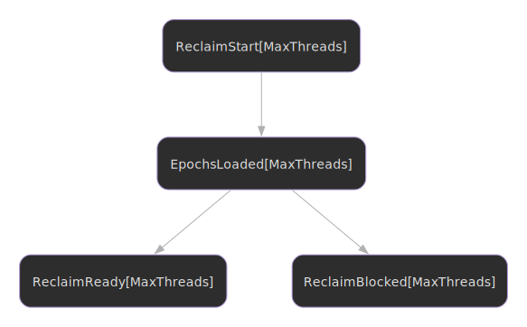

# Reclamation

Understanding safe memory reclamation in DEBRA+.

## State Machine



## Overview

Reclamation is the process of safely freeing retired objects. Each registered
thread reclaims its own retired objects from its own thread-local limbo bag
list. There is no cross-thread reclamation: the bag list is mutated by the
owning thread (via `retire`) without synchronization, so another thread cannot
walk it safely.

## Per-thread reclamation

Pass your `ThreadHandle` to `reclaimStart(handle)` (or `reclaimNow(handle)`) to
walk and free your own thread's retired objects. A thread that retires but
never calls reclaim leaks its bags. The recommended pattern is to fold a
reclaim attempt into your hot path on a cadence (e.g. once every N retires);
see the [epoch advancement guide](epoch-advancement.md).

If a thread stalls or exits while still pinned, the [neutralization
mechanism](neutralization.md) forces it to unpin so the global epoch can
advance, but it does not free that thread's already-retired bags. Drain
your bags before exiting the thread.

## Reclamation Steps

1. **Start**: Begin reclamation process for your handle's slot
2. **Load epochs**: Read global epoch and all thread epochs
3. **Check safety**: Determine if any epochs are safe to reclaim
4. **Try reclaim**: Walk this thread's own limbo bags and free eligible objects

## Epoch Safety

The safe epoch is the minimum of all pinned thread epochs. Objects retired in epoch E are safe to reclaim if `E < safeEpoch - 1`.

## Periodic Reclamation

Attempt reclamation every N operations to amortize the cost:

```nim

```

[:material-file-code: View full source](https://github.com/elijahr/nim-debra/blob/main/examples/reclamation_periodic.nim)

## Background Epoch Advancement

A dedicated background thread cannot reclaim other threads' retired objects:
each thread reclaims its own. A background thread is still useful for driving
the global epoch forward (`manager.advance()`) while workers continue to
retire and reclaim on their own slots.

```nim

```

[:material-file-code: View full source](https://github.com/elijahr/nim-debra/blob/main/examples/reclamation_background.nim)

## Blocked Reclamation

If `safeEpoch <= 1`, reclamation is blocked. This is normal when:

- All threads pinned at current epoch
- Only one epoch has passed since start

Options when blocked:

1. **Advance epoch**: Trigger epoch advancement
2. **Wait**: Try again later
3. **Neutralize**: If a thread is stalled, neutralize it

## Reclamation Scheduling

**Too frequent:**
- Wastes CPU checking epochs
- Most checks find nothing to reclaim

**Too infrequent:**
- Accumulates memory
- Longer pause when reclaim happens

**Recommended**: Every 100-1000 operations or every 10-100ms.

## Performance Considerations

Reclamation cost:

- **Load epochs**: O(m) where m = max threads
- **Walk bags**: O(n) where n = retired objects
- **Total**: O(m + n)

Optimization tips:

1. **Batch reclamation**: Don't reclaim after every operation
2. **Cadence helper**: Use `handle.advanceEvery(n)` plus a periodic `reclaimNow(handle)` call
3. **Threshold**: Only reclaim when enough objects accumulated

## Next Steps

- Learn about [neutralization](neutralization.md)
- Understand [integration patterns](integration.md)
