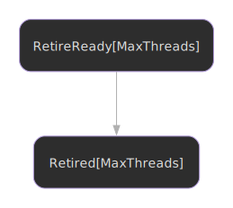

# Retiring Objects

Understanding how to retire objects for safe reclamation.

## State Machine



## Overview

When you remove an object from a lock-free data structure, you cannot immediately free it - other threads might still be accessing it. Instead, you **retire** the object, marking it for later reclamation when safe.

## The Managed Type

DEBRA uses the `Managed[T]` wrapper type to track objects that need epoch-based reclamation:

```nim
type
  NodeObj = object
    value: int
    next: Atomic[Managed[ref NodeObj]]
  Node = ref NodeObj

# Create a managed node - GC won't collect until retired
let node = managed Node(value: 42)
```

The `managed()` proc calls `GC_ref` internally, preventing Nim's garbage collector from freeing the object. Only DEBRA's reclamation process (via `GC_unref`) can free it.

## Self-Referential Types

When a type references itself (like linked list nodes), use the `ref Obj` pattern:

```nim
# CORRECT - use ref Obj pattern for self-reference
type
  NodeObj = object
    value: int
    next: Atomic[Managed[ref NodeObj]]  # Self-reference works
  Node = ref NodeObj

# INCORRECT - ref object inline won't work
type
  Node = ref object
    value: int
    next: Atomic[Managed[Node]]  # Won't compile
```

This is a Nim limitation with generic distinct types and forward references.

## Basic Retirement

You must be pinned to retire objects:

```nim

```

[:material-file-code: View full source](https://github.com/elijahr/nim-debra/blob/main/examples/retire_single.nim)

## Multiple Object Retirement

When retiring multiple objects in a single critical section, use `retireReadyFromRetired()` to chain retirements:

```nim

```

[:material-file-code: View full source](https://github.com/elijahr/nim-debra/blob/main/examples/retire_multiple.nim)

## Accessing Managed Fields

The `Managed[T]` type provides transparent field access:

```nim
let node = managed Node(value: 42, name: "test")

# Direct field access via dot template
echo node.value  # 42
echo node.name   # "test"

# When you need the actual ref
doSomething(node.inner)
```

## Limbo Bags

Retired objects are stored in thread-local limbo bags:

- Each bag holds up to 64 objects
- Bags are chained together by epoch
- Reclamation walks bags from oldest to newest

## Retirement Timing

Always unlink first, then retire:

```nim
# RIGHT - retire after unlinking
if head.compareExchange(oldHead, next, moRelease, moRelaxed):
  let ready = retireReady(pinned)
  discard ready.retire(oldHead)

# WRONG - retire before unlinking (unsafe!)
let ready = retireReady(pinned)
discard ready.retire(oldHead)
head.store(next, moRelease)
```

## Best Practices

### Do Retire Objects That:

- Were removed from shared data structures
- Are no longer reachable via shared pointers
- Might still be accessed by concurrent threads

### Don't Retire Objects That:

- Are still reachable in the data structure
- Are local to the current thread (just let them go out of scope)
- Are static/global (they're never freed)

## Next Steps

- Learn about [reclamation](reclamation.md)
- Understand [neutralization](neutralization.md)
- See [integration examples](integration.md)
