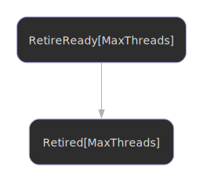

# Retiring Objects

Understanding how to retire objects for safe reclamation.

## State Machine



## Overview

When you remove an object from a lock-free data structure, you cannot
immediately free it: other threads might still be accessing it. Instead,
you **retire** it, handing DEBRA a raw pointer plus a destructor closure.
The destructor runs once all threads have advanced past the retiring epoch.

## The `retire` API

`retire` takes a type-erased pointer and a `Destructor`:

```nim
proc retire(ready: RetireReady[N], p: pointer, dtor: Destructor): Retired[N]
```

The destructor is a `proc(p: pointer) {.nimcall.}`. DEBRA does not interpret
the pointer; the destructor is responsible for any cleanup (calling
`dealloc`, `GC_unref`, custom finalizers, etc.).

## Bridging `ref T` with `retain` and `releaseDestructor`

Lock-free data structures usually want to store `Atomic[ptr T]` field slots
because `Atomic[ref T]` falls back to a spinlock under arc/orc, silently
breaking lock-freedom. The `debra/refptr` module bridges Nim's GC-managed
`ref` types into raw pointers with explicit refcount tracking:

- `retain(obj: ref T) -> ptr T` GC-refs the object and returns a raw
  pointer suitable for `Atomic[ptr T]` storage.
- `releaseDestructor[T]() -> Destructor` returns a closure that
  `GC_unref`s a `ptr T` once the epoch is safe.

Pair every `retain` with exactly one `release` (typically by handing
`releaseDestructor[T]()` to `retire`).

```nim
import debra
import debra/atomics

type
  NodeObj = object
    value: int
    next: Atomic[ptr NodeObj]
  Node = ref NodeObj

# Allocate and GC-pin a node; `node` is a raw `ptr NodeObj`.
let node = retain Node(value: 42)

# Later, after unlinking it from shared state:
let ready = retireReady(pinned)
discard ready.retire(cast[pointer](node), releaseDestructor[NodeObj]())
```

`releaseDestructor[T]()` returns a captureless `nimcall` function pointer:
each `T` instantiation produces one proc address that is reused across calls,
so handing it inline to `retire` does not allocate.

## Self-Referential Types

For linked structures, use the `ref Obj` pattern with `Atomic[ptr NodeObj]`:

```nim
type
  NodeObj = object
    value: int
    next: Atomic[ptr NodeObj]
  Node = ref NodeObj
```

`ptr` is opaque to Nim's type checker, so the recursive shape resolves
naturally. There is no forward-declaration dance.

## Basic Retirement

You must be pinned to retire:

```nim

```

[:material-file-code: View full source](https://github.com/elijahr/nim-debra/blob/main/examples/retire_single.nim)

## Multiple Object Retirement

When retiring multiple objects in a single critical section, use
`retireReadyFromRetired()` to chain retirements:

```nim

```

[:material-file-code: View full source](https://github.com/elijahr/nim-debra/blob/main/examples/retire_multiple.nim)

## Limbo Bags

Retired pointers (and their destructors) are stored in thread-local limbo bags:

- Each bag holds up to 64 entries
- Bags are chained together by epoch
- Reclamation walks bags from oldest to newest, invoking each destructor

## Retirement Timing

Always unlink first, then retire:

```nim
# RIGHT - retire after unlinking
if head.compareExchangeStrong(oldHead, next, moRelease, moRelaxed):
  let ready = retireReady(pinned)
  discard ready.retire(cast[pointer](oldHead), releaseDestructor[NodeObj]())

# WRONG - retire before unlinking (unsafe!)
let ready = retireReady(pinned)
discard ready.retire(cast[pointer](oldHead), releaseDestructor[NodeObj]())
head.store(next, moRelease)
```

## Best Practices

### Do Retire Objects That:

- Were removed from shared data structures
- Are no longer reachable via shared pointers
- Might still be accessed by concurrent threads

### Don't Retire Objects That:

- Are still reachable in the data structure
- Are local to the current thread (just let them go out of scope)
- Are static/global (they're never freed)

## Next Steps

- Learn about [reclamation](reclamation.md)
- Understand [neutralization](neutralization.md)
- See [integration examples](integration.md)
